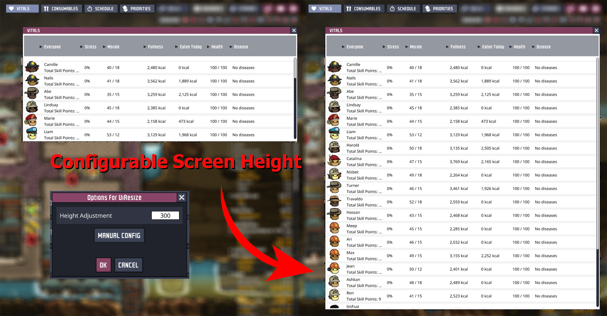
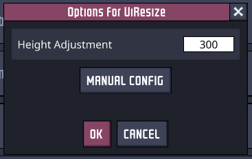

Tired of scrolling through dozens of dups in the tiny Priorities screen?  Now you can resize the duplicant management screens to handle more dups!

This mod provides a configurable height adjustment for the following screens via the Mod Options menu:

- Vitals
- Consumables
- Schedule
- Priorities

Thanks to Peter Han for the excellent PLib library, which provides the configuration UI: https://github.com/peterhaneve/ONIMods/tree/master/PLib

# Known Issues

- Incorrect outline placement on Consumables screen.