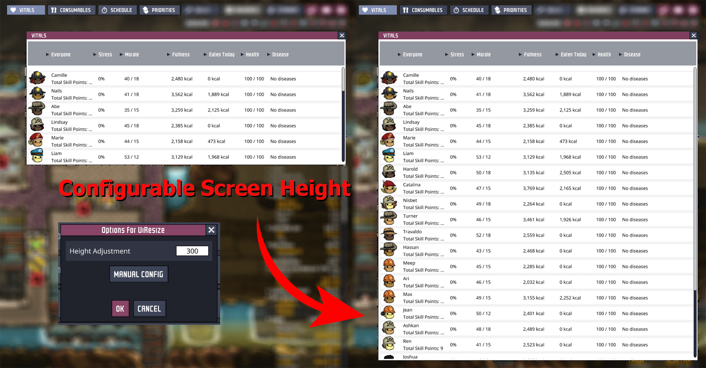

Tired of scrolling through dozens of dups in the tiny Priorities screen?  Now you can resize the duplicant management screens to handle more dups!



This mod provides a configurable height adjustment for the following screens via the Mod Options menu:

- Vitals
- Consumables
- Schedule
- Priorities


Thanks to Peter Han for the excellent PLib library, which provides the configuration UI: https://github.com/peterhaneve/ONIMods/tree/master/PLib

# Spaced Out DLC?

I don't have the Spaced Out DLC and do not know if this mod is compatible.  You can test it by updating `mod_info.yaml` with:

```
supportedContent: ALL
```


# Known Issues

- Incorrect outline placement on Consumables screen.

# Development & Build

Create a "lib" directory at the repository root and copy the following assemblies from your ONI install: \OxygenNotIncluded\OxygenNotIncluded_Data\Managed\:

- 0Harmony.dll
- Assembly-CSharp-firstpass.dll
- Assembly-CSharp.dll
- Newtonsoft.Json.dll
- Unity.TextMeshPro.dll
- UnityEngine.CoreModule.dll
- UnityEngine.dll
- UnityEngine.ImageConversionModule.dll
- UnityEngine.InputLegacyModule.dll
- UnityEngine.TextRenderingModule.dll
- UnityEngine.UI.dll
- UnityEngine.UIModule.dll
- UnityEngine.UnityWebRequestModule.dll

"Build" the solution to deploy the Mod to your Mods\Dev directory.

A post-build action deploys the mod .dll (ILMerged with PLib) and .yaml files.