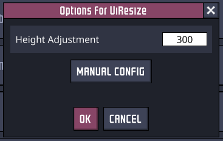
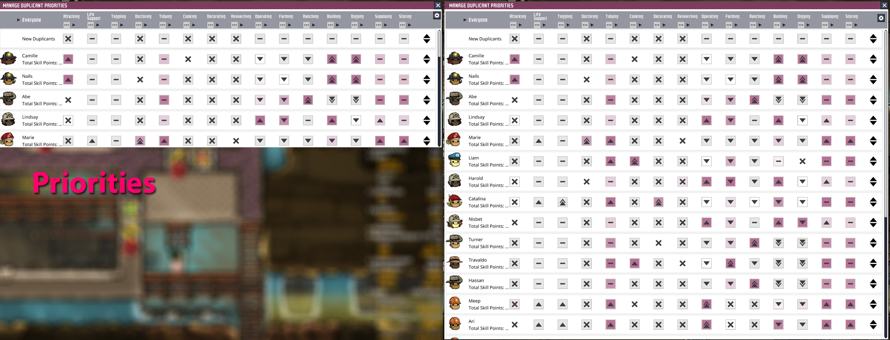

# About

Mod for Oxygen Not Included which adjusts the UI to show more information on one screen.  The following elements are adjusted:

- Vitals
- Consumables
- Schedule
- Priorities

Height adjustment is configurable via the Mod Options menu.

This mod uses Peter Han's library https://github.com/peterhaneve/ONIMods/tree/master/PLib

# Known Issues

- Mispositioned settings icon on Priorities screen.
- Incorrect outline on Consumables screen.

# Building

Create "lib" directory at the repository root and copy the following assemblies from \OxygenNotIncluded\OxygenNotIncluded_Data\Managed:

- 0Harmony.dll
- Assembly-CSharp-firstpass.dll
- Assembly-CSharp.dll
- Newtonsoft.Json.dll
- Unity.TextMeshPro.dll
- UnityEngine.CoreModule.dll
- UnityEngine.dll
- UnityEngine.ImageConversionModule.dll
- UnityEngine.TextRenderingModule.dll
- UnityEngine.UI.dll
- UnityEngine.UIModule.dll

A post-build action deploys the UiResize.dll (merged with PLib) to the Mods\Dev directory.